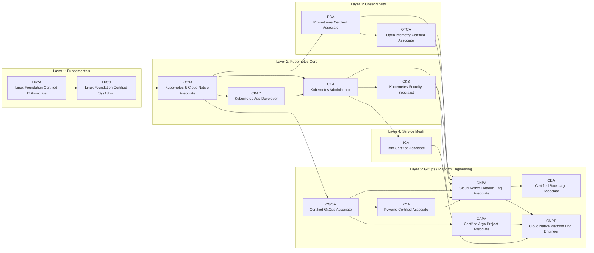

```mermaid
flowchart LR
    subgraph L1[Layer 1: Fundamentals]
        LFCA[LFCA<br>Linux Foundation Certified IT Associate]
        LFCS[LFCS<br>Linux Foundation Certified SysAdmin]
    end

    subgraph L2[Layer 2: Kubernetes Core]
        KCNA[KCNA<br>Kubernetes & Cloud Native Associate]
        CKAD[CKAD<br>Kubernetes App Developer]
        CKA[CKA<br>Kubernetes Administrator]
        CKS[CKS<br>Kubernetes Security Specialist]
    end

    subgraph L3[Layer 3: Observability]
        PCA[PCA<br>Prometheus Certified Associate]
        OTCA[OTCA<br>OpenTelemetry Certified Associate]
    end

    subgraph L4[Layer 4: Service Mesh]
        ICA[ICA<br>Istio Certified Associate]
    end

    subgraph L5[Layer 5: GitOps / Platform Engineering]
        CGOA[CGOA<br>Certified GitOps Associate]
        KCA[KCA<br>Kyverno Certified Associate]
        CAPA[CAPA<br>Certified Argo Project Associate]
        CNPA[CNPA<br>Cloud Native Platform Eng. Associate]
        CBA[CBA<br>Certified Backstage Associate]
        CNPE[CNPE<br>Cloud Native Platform Eng. Engineer]
    end

    %% Dependencies

    LFCA --> LFCS
    LFCS --> KCNA

    KCNA --> CKAD
    KCNA --> CKA
    CKAD --> CKA

    CKA --> CKS
    CKA --> ICA

    KCNA --> PCA
    PCA --> OTCA

    KCNA --> CGOA
    CGOA --> CAPA
    CGOA --> KCA

    CKA --> CNPA
    PCA --> CNPA
    OTCA --> CNPA
    CGOA --> CNPA
    ICA --> CNPA
    KCA --> CNPA

    CNPA --> CBA
    CNPA --> CNPE
    CAPA --> CNPE
    CKS --> CNPE
```
